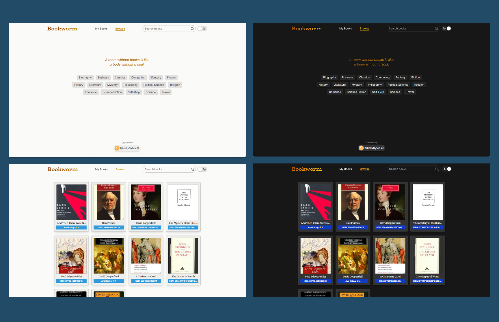
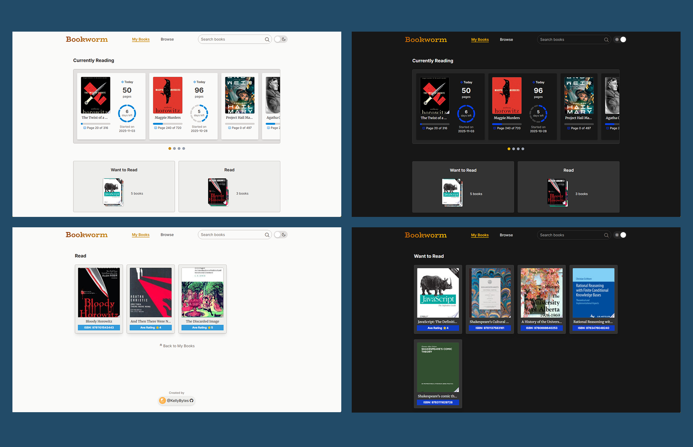
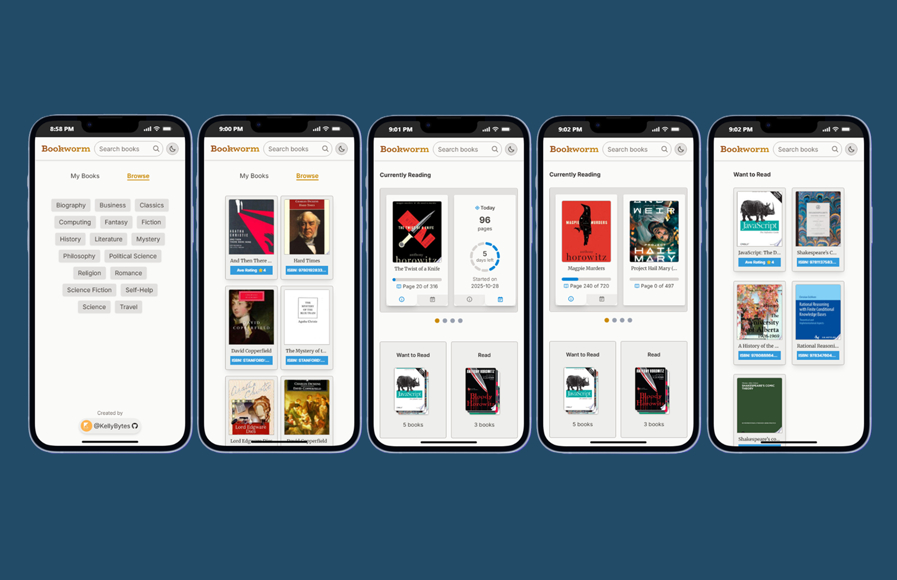
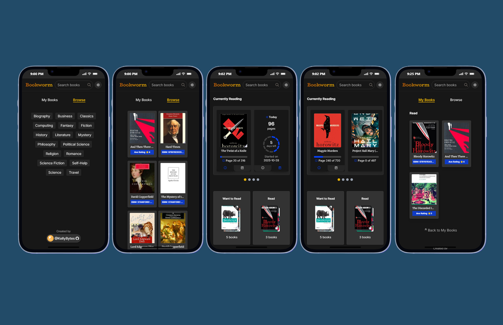
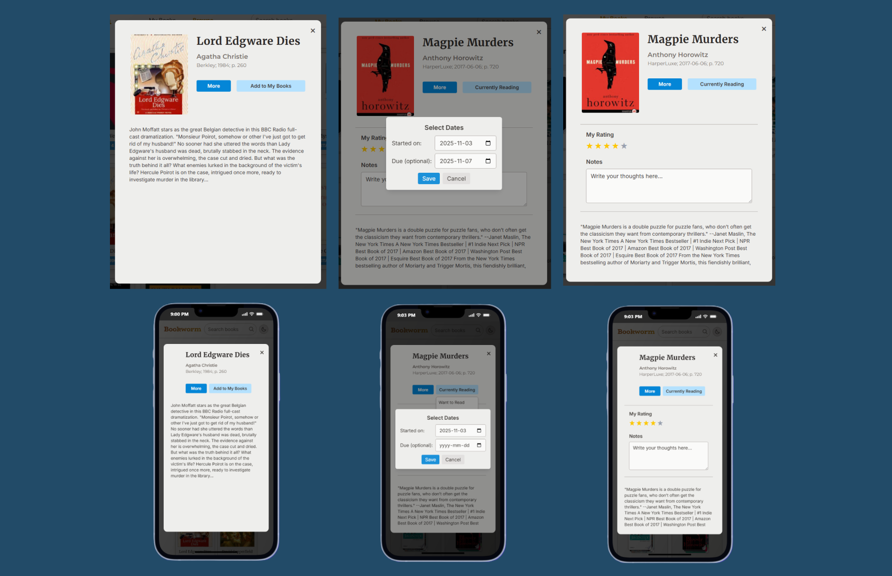

# [Bookworm | Reading Tracker App](https://kb-bookworm.netlify.app "Click to launch Bookworm")

### Screenshots

 

 
 

 

 
 

---

## 💡 Overview

**Bookworm** is a responsive web application that helps users **track their reading progress** using data from the **Google Books API**. Users can search for books, organize them into shelves, set due dates, and view daily reading goals — all while keeping notes and ratings for future reference. All data is stored locally for persistence, and users can easily switch between light and dark themes.

---

## ⚙️ Key Features

- Search and fetch books using **Google Books API**
- Categorize books into *Currently Reading*, *Want to Read*, and *Read* shelves
- Track **progress**, **remaining days**, and **pages per day** dynamically
- Add personalized **notes** and **ratings** for completed books
- **Light/Dark mode** with a smooth theme switcher
- Fully responsive design for all screen sizes

---

## 🧩 Tech Stack

- **ReactJS** – component-based UI and state management
- **Tailwind CSS** – responsive styling and dark mode support
- **Google Books API** – external data integration
- **localStorage API** – persistent data storage on the client side

---

## 🧠 What I Learned

- Integrating and managing third-party APIs with **axios**
- Designing and optimizing **localStorage data structures** for scalability
- Refactoring reusable components and managing **state across nested components**
- Implementing **dynamic calculations** for reading progress and deadlines
- Creating an accessible, minimal UI adaptable to **desktop and mobile** environments

---

### 🚀 Future Improvements

- Ability to manually add books not available in the Google Books database
- Integration with external APIs to sync progress across devices

---

[🔼 Back to Top](#bookworm--reading-tracker-app)
