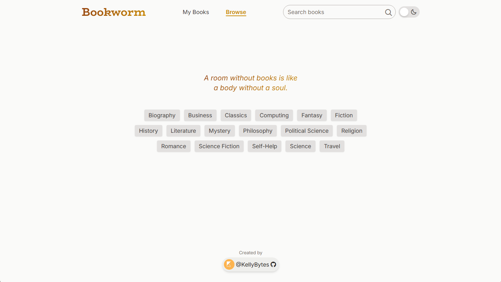
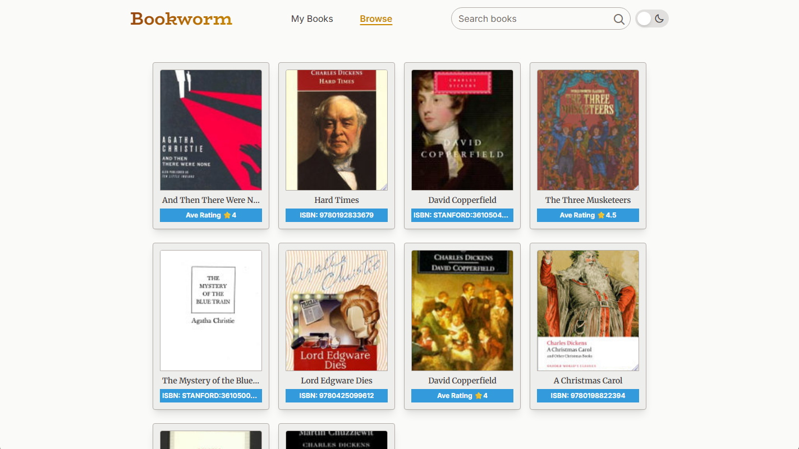
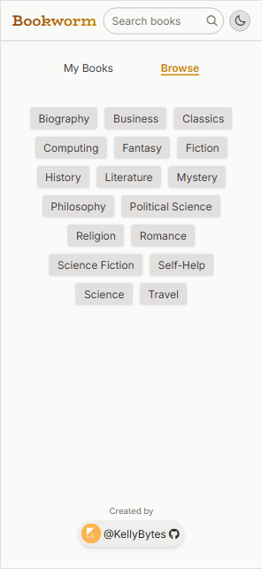
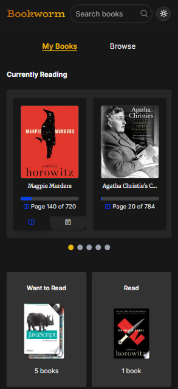

# Bookworm | Reading Tracker

## Overview

A ReactJS Reading Tracker web application built with Tailwind CSS and Google Books API.

### Features
- Search books from Google Books database
- Save books to bookshelves -- Currently Reading, Want to Read, and Read
- Track reading progress
- Set due and check remaining days and how many pages to read today
- Add your own ratings and notes to Read and Currently Reading books
- Responsive design
- Switch between Dark Mode and Light Mode with mode switcher

### Built with
- ReactJS
- Tailwind CSS
- Google Books API

---

## Screenshots

**Desktop**

Book Search

  
  
   
  
  

 

My Books - Bookshelves and Progress

  
  

 

Modal

  
  

 

  
  

 

**Mobile**

Book Search

  
  
   
  
  

 

My Books - Bookshelves and Progress

  
  

 

